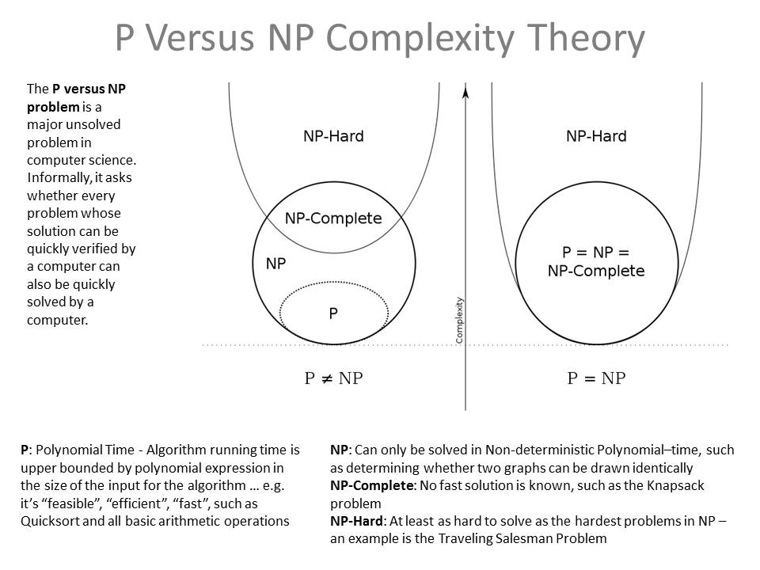

# Big O Definition

- picture a graph for an algorithm with the y axis being time and the x axis being input size
	- to count n pencils, i touch n pencils
	- to count n + 1 pencils, I touch n + 1 pencils
	- this is a linear graph

- That is "Big O of n" or "O(n)"
	- "This algorithm finishes in no more than linear time"
	- "Omega (ω) of n" changes that to "no less than"
	- "Theta (θ) of n" changes that to "exactly"
	- The reason why O is the most used over Theta is **we don't actually care about the precise speed, just the worst case**
		- `testing for speed is benchmarking`
	- we also only **care about the shape, not the curve**

# O(n^2)
- everyone in class has to shake everyone's hand
- one more person appears. how many more handshakes is that?
	- for pencils, one more pencil was one more actions
	- here the new person must shake n persons hands
	- "for each person, shake each person"
- technically "(n^2 - n) / 2" 
- we do not want the exact curve, just the shape
	- n^2 is the worst there, so it dominates at n = 10,000,000

# O(log n)
- the curve decelerates, just like how n-squared accelerated
- it takes me a minute to eat half of the cookies
	- 3: Nom, 1, Nom
	- 4: Nom, 2, Nom, 1, Nom
	- 5: Nom, 2, Nom
	- 6: Nom, 3, Nom
	- 7: Nom, 3, Nom
	- 8: Nom, 4, Nom

# Big O Guidelines
- if any part of an algoorithm is n^2, it is O(n^2)
- a loop is O(n)
	- do something to everything
- a loop in a loop is O(n^2)
	- for each thing, do something to everything
- recursion can be exponential O(2^n) if you are not careful
	- for each thing... run the program on each thing
- the cost of anything not related to n is irrelevant
	- branches, funciton calls, variables

# Vector's Big O's
- if you do not have all the methods *and* at the right speed

# Examples
- 1. I tell all of you to go buy me a pizza
	- a. Pizzas bought: O(n)
- 2. I shout out for everyone to buy me a pizza
	- a. Shouts: O(1)
- 3. I tell you all to buy a pizza for each student in the class
	- a. Pizzas bought: O(n^2)
- 4. I tell you to find the heaviest pizza
	- a. Weigh all pizzas: O(n)
- 5. I tell you to find the two closest pizzas
	- a. measure distance

# Best / Worst Cases
- we have O, Omega, and Theta for "no worse", "no better", and "exactly"
	- pure computer science level
- in real life we have concrete concerns 
	- an algorithm is O(1) 99% of the time and O(n^2) 1% of the time (**A**). Pick that or a 100% O(n) (**B**)?
		 - medical equipment, **B**. webpage, **A**.
- This means that we may actually 

# Time and Big O's
- If i am running an algorithm on 1,000 records twice a week, Big O matters less
- If I am running 1,000 simulations a second on a chip meant for spacecraft, Big O is not enough
- "benchmarking" is almost the opposite of Big O
	- mea
- "Amortized" (a'-more-tized) is taking Big O over time

# P vs NP

- If I have a problem I can solve with a Big O, then that is a polynomial (n, n^2, 1, log), it's **easy**
- If I cannot, but I am given an answer I can check if it is right in polynomial time, it is **hard**
- **Polynomial vs Non-deterministic Polynomial**
### NP Complete
- All NP problems can be transformed in to any other NP problem
- It follows that if you can solve any NP problem, you will solve them all
	- meaning that P == NP
	- there is a million dollar prize for doing this, and it would **change computing** forever
- Not only can we not prove that, we cannot prove that we cannot prove that
